# OpsRelay Mermaid diagrams

The system is represented at business, logical, cloud, UML-style, ML, security, and resilience levels. Mermaid flowcharts are used where Mermaid does not provide a native UML notation.

## 1. End-to-End System Architecture

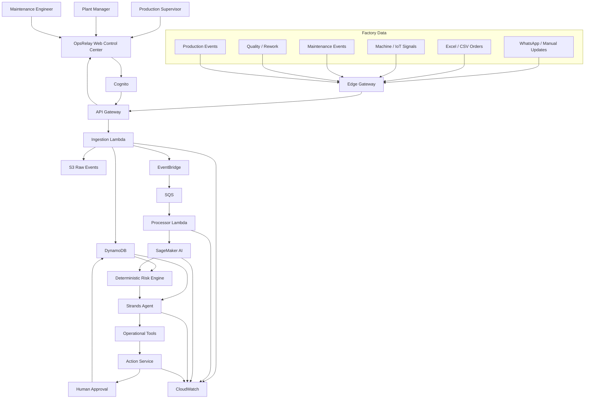

## 2. Logical Architecture

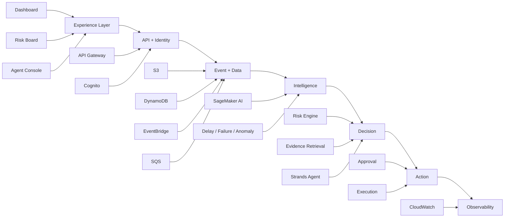

## 3. Use Cases

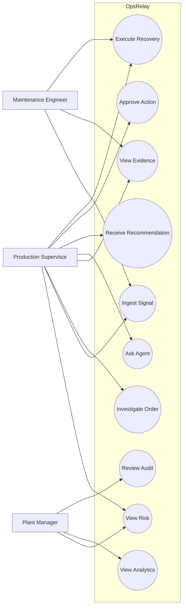

## 4. Class Diagram

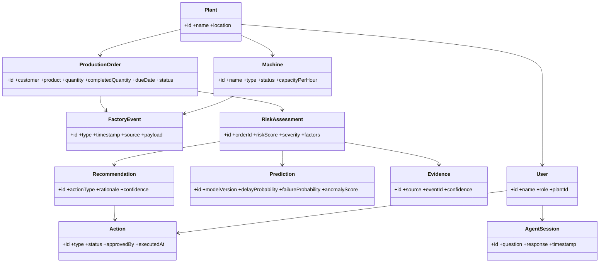

## 5. Sequence — Event to Recommendation

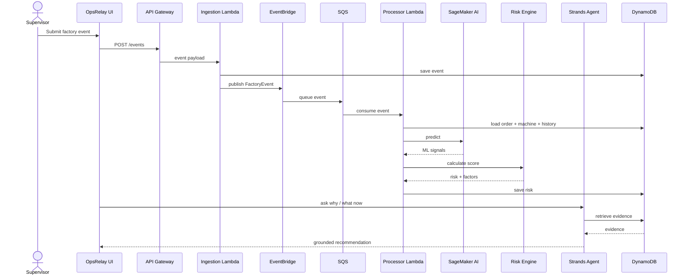

## 6. Activity

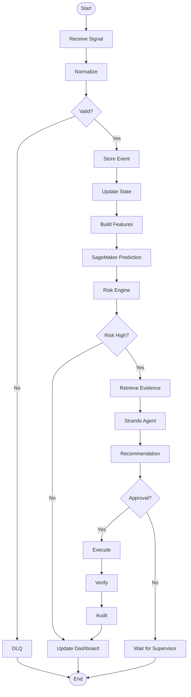

## 7. State Machine — Order

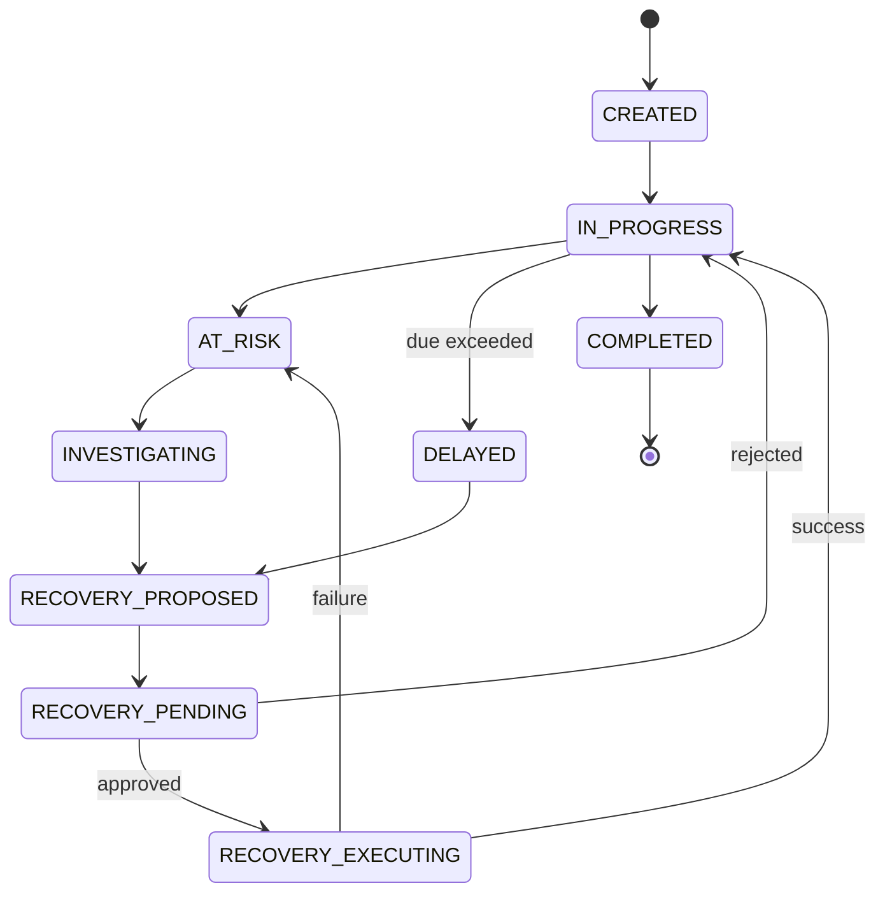

## 8. State Machine — Machine

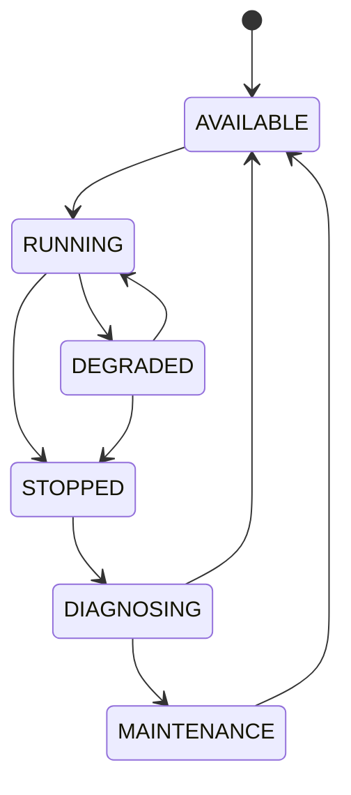

## 9. Deployment

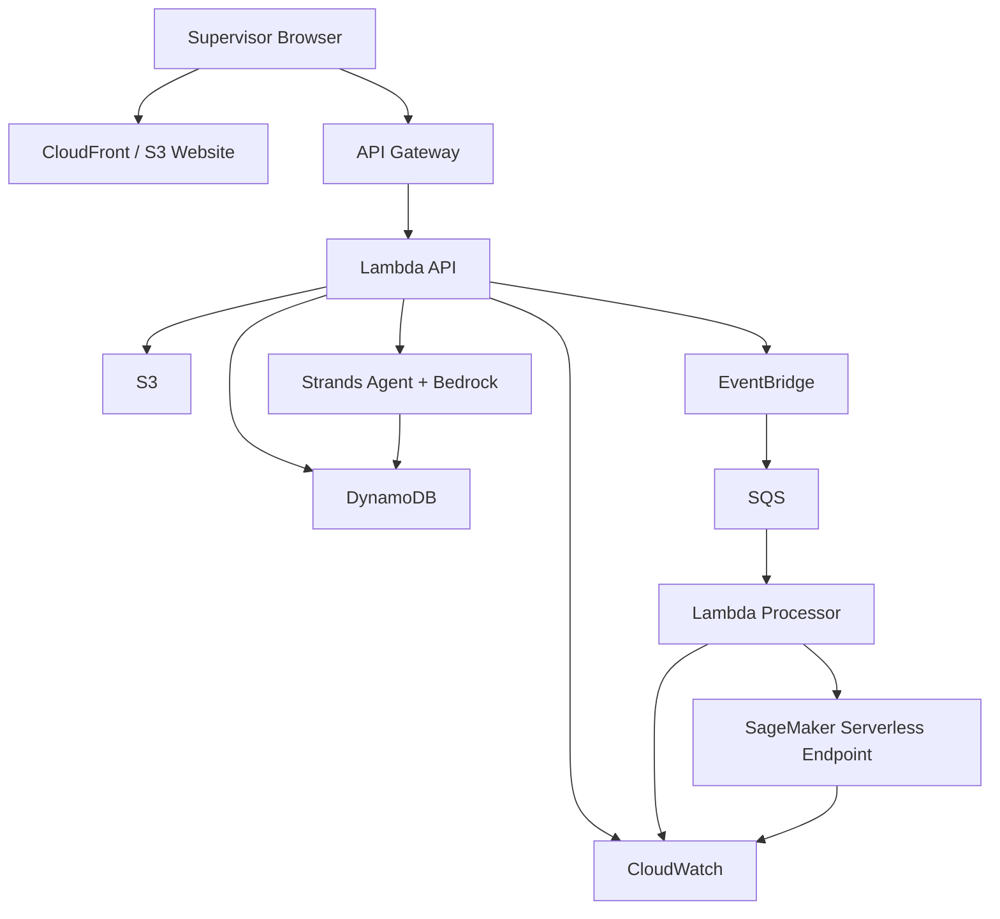

## 10. ER Diagram

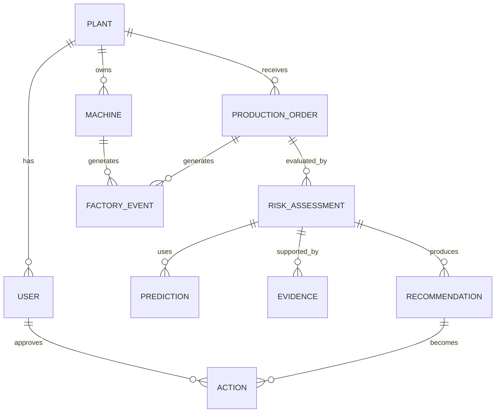

## 11. AI/ML Pipeline

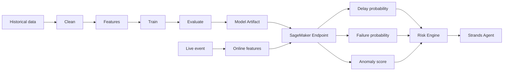
